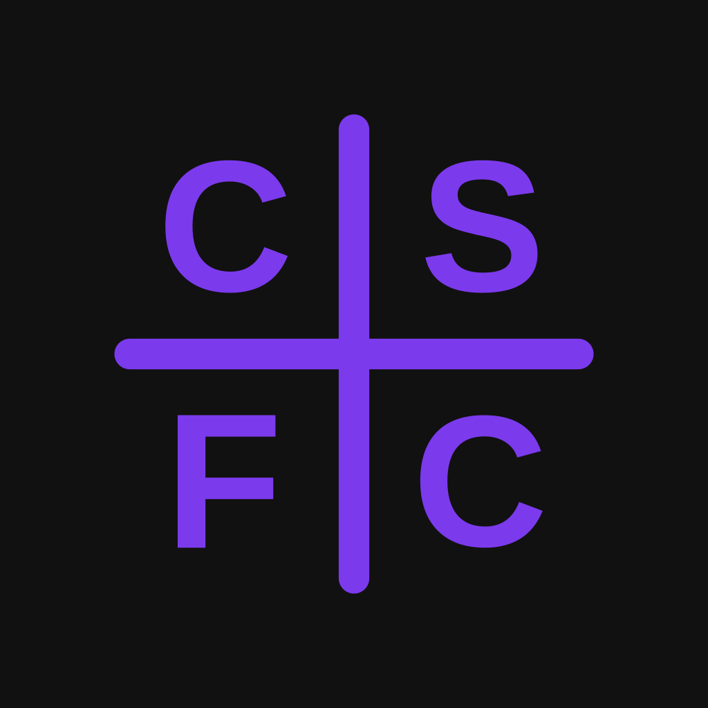

# CSFC

**Calculator**

Android Calculator With Configurable Order of Operations

---

## What is CSFC?

CSFC is a free and open-source Android calculator built around one idea: order of operations isn't universal. Most calculator apps silently apply a single fixed convention and never tell you which one. CSFC instead lets you choose the system you were taught, and switch between them whenever you like.

Built and maintained by **[@jhaiian](https://github.com/jhaiian)** — a solo developer from the Philippines 🇵🇭

---

## Supported Order-of-Operations Systems

- **PEMDAS** — Parentheses, Exponents, Multiplication, Division, Addition, Subtraction (United States)
- **BEDMAS** — Brackets, Exponents, Division, Multiplication, Addition, Subtraction (Canada and some other countries)
- **BODMAS** — Brackets, Orders, Division, Multiplication, Addition, Subtraction (UK, India, and many Commonwealth countries)
- **BIDMAS** — Brackets, Indices, Division, Multiplication, Addition, Subtraction (UK, Australia)
- **PEDMAS** — Parentheses, Exponents, Division, Multiplication, Addition, Subtraction (Some Canadian schools)
- **GEMA** — Grouping, Exponents, Multiplication/Division, Addition/Subtraction (Some math education materials)

---

## Requirements

- Android 8.0 (API 26) or higher

---

## Installation

Download the latest APK from the [Releases](https://github.com/jhaiian/CSFC/releases) page.

---

## Contributing

Contributions, bug reports, and feature requests are welcome.

1. [Open an issue](https://github.com/jhaiian/CSFC/issues) to report a bug or suggest a feature.
2. Fork the repo and create a branch for your change.
3. Submit a pull request with a clear description.

For more details, see [Contributing.md](https://github.com/jhaiian/CSFC/blob/main/Contributing.md).

---

# License

The source code of this project is licensed under the [GNU General Public License v3.0 (GPLv3)](https://github.com/jhaiian/CSFC/blob/main/LICENSE).

The name "CSFC," the logo, screenshots, and all related branding assets are **trademarks** or **proprietary assets** of the author and are **not licensed under the GPL**. Use of these assets requires explicit permission from the author.
